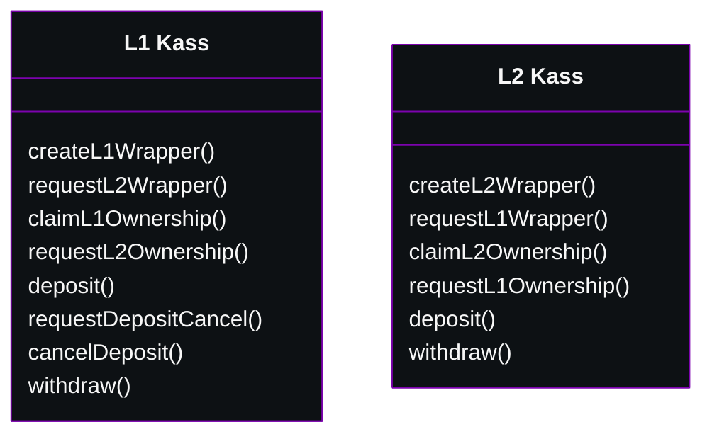
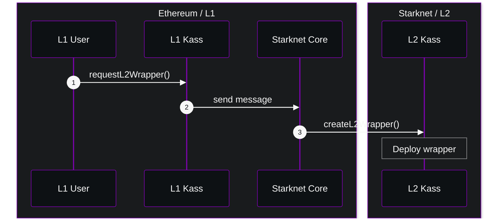
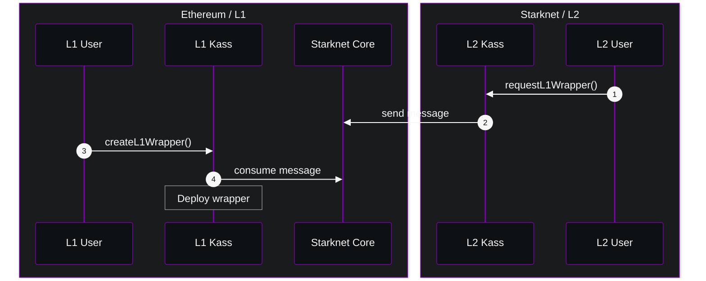

  <h1 align="center">🪗 Kass - Starknet NFT bridge</h1>

This repo contains the reference implementation of the Kass protocol.

---

Kass is a bridge between Ethereum and Starknet allowing the transfer of ERC721 and ERC1155 tokens. Kass is compatible with both L1 and L2 native tokens.

## 🎡 Architecure overview

Kass protocol is composed of 2 smart contracts on Ethereum and Starknet, offering approximately the same interface.

### Wrapper Creation

In order to successfuly bridge assets through chains, Kass needs to deploy an equivalent token contract (either ERC721 or ERC1155) on the target chain. This process is called the wrapper creation.

#### L2 Wrapper creation

> *Creation of a wrapper on Starknet, in order to deposit L1 native tokens to Starknet.*

### L1 Wrapper creation

> *Creation of a wrapper on Ethereum, in order to deposit L2 native tokens to Starknet.*

## ⚠️ Disclaimer

This repo contains highly experimental code. Use at your own risk.
